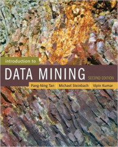
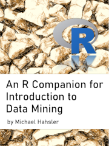

# R Companion for Introduction to Data Mining

R and [tidyverse](https://www.tidyverse.org/) are very popular for data mining.
This repository contains slides and documented R examples to accompany several
chapters of the popular data mining textbook:

> Pang-Ning Tan, Michael Steinbach, Anuj Karpatne and Vipin Kumar, 
> [_Introduction to Data Mining,_](https://www-users.cs.umn.edu/~kumar001/dmbook/index.php) 
> Addison Wesley, 1st or 2nd edition.

The slides and examples are used in my course _CS 5/7331 Data Mining_ taught at
[SMU](https://www.smu.edu/) and will be regularly updated and improved.  The
code examples are now compiled into the free online book [An R Companion for
Introduction to Data
Mining](https://mhahsler.github.io/Introduction_to_Data_Mining_R_Examples/book/)
which is published under the Creative Commons Attribution license and you can
share and adapt them freely. Please open an [issue](issues) for corrections or
to suggest improvements. 

## Content

* [Browse the online book](https://mhahsler.github.io/Introduction_to_Data_Mining_R_Examples/book/)
* [Download the book as a PDF](https://mhahsler.github.io/Introduction_to_Data_Mining_R_Examples/book/R-Companion-Data-Mining.pdf)

| Companion Chapter | Lecture Slides | Free Textbook Chapter  |  
| :--------| :---: | :----: |
| 1. [Introduction](https://mhahsler.github.io/Introduction_to_Data_Mining_R_Examples/book/introduction.html) | [PDF](https://mhahsler.github.io/Introduction_to_Data_Mining_R_Examples/slides/chap1_intro.pdf), [PowerPoint](https://mhahsler.github.io/Introduction_to_Data_Mining_R_Examples/slides/chap1_intro.pptx) | -  |
| 2. [Data](https://mhahsler.github.io/Introduction_to_Data_Mining_R_Examples/book/data.html) | [PDF](https://mhahsler.github.io/Introduction_to_Data_Mining_R_Examples/slides/chap2_data.pdf), [PowerPoint](https://mhahsler.github.io/Introduction_to_Data_Mining_R_Examples/slides/chap2_data.pptx) | - | 
| 2.5. [Exploring Data](https://mhahsler.github.io/Introduction_to_Data_Mining_R_Examples/book/data.html#data-exploration)  | [PDF](https://mhahsler.github.io/Introduction_to_Data_Mining_R_Examples/slides/chap2_exploration.pdf), [PowerPoint](https://mhahsler.github.io/Introduction_to_Data_Mining_R_Examples/slides/chap2_exploration.pptx) | Web Chapter [Exploring Data](./DM_chapters/data_exploration_1st_edition.pdf)  | 
| 3. [Classification: Basic Concepts](https://mhahsler.github.io/Introduction_to_Data_Mining_R_Examples/book/classification-basic-concepts.html) | [PDF](https://mhahsler.github.io/Introduction_to_Data_Mining_R_Examples/slides/chap3_basic_classification.pdf), [PowerPoint](https://mhahsler.github.io/Introduction_to_Data_Mining_R_Examples/slides/chap3_basic_classification.pptx) | [3. Classification](./DM_chapters/ch3_classification.pdf) | 
| 4. [Classification: Alternative Techniques](https://mhahsler.github.io/Introduction_to_Data_Mining_R_Examples/book/classification-alternative-techniques.html) | [PDF](https://mhahsler.github.io/Introduction_to_Data_Mining_R_Examples/slides/chap4_alternative_classification.pdf), [PowerPoint](https://mhahsler.github.io/Introduction_to_Data_Mining_R_Examples/slides/chap4_alternative_classification.pptx) | - |
| 5. [Association Analysis: Basic Concepts](https://mhahsler.github.io/Introduction_to_Data_Mining_R_Examples/book/association-analysis-basic-concepts.html)  | [PDF](https://mhahsler.github.io/Introduction_to_Data_Mining_R_Examples/slides/chap5_basic_association_analysis.pdf), [PowerPoint](https://mhahsler.github.io/Introduction_to_Data_Mining_R_Examples/slides/chap5_basic_association_analysis.pptx)  | [5. Association Analysis](./DM_chapters/ch5_association_analysis.pdf) |
| 6. [Association Analysis: Advanced Concepts](https://mhahsler.github.io/Introduction_to_Data_Mining_R_Examples/book/association-analysis-advanced-concepts.html) | - | - |
| 7. [Cluster Analysis: Basic Concepts](https://mhahsler.github.io/Introduction_to_Data_Mining_R_Examples/book/cluster-analysis.html) | [PDF](https://mhahsler.github.io/Introduction_to_Data_Mining_R_Examples/slides/chap7_basic_cluster_analysis.pdf), [PowerPoint](https://mhahsler.github.io/Introduction_to_Data_Mining_R_Examples/slides/chap7_basic_cluster_analysis.pptx) | [7. Cluster Analysis](./DM_chapters/ch7_clustering.pdf) | 
| 8. [Regression](https://mhahsler.github.io/Introduction_to_Data_Mining_R_Examples/book/regression.html) | - | [Appendix D](https://www-users.cse.umn.edu/~kumar001/dmbook/appendices_2ed.pdf) | 
| 9. [Logistic Regression](https://mhahsler.github.io/Introduction_to_Data_Mining_R_Examples/book/logistic-regression-1.html) | - | (covered in Chapter 4.6) | 

## Interactive Help

* Ask the [R Wizard](https://chatgpt.com/g/g-TgjKDuQwZ-r-wizard) (GPT) to explain R code
 and help with writing code.
 
  
## Software Requirements

You need to install:

* [R](https://cran.r-project.org/)
* [R Studio Desktop](https://posit.co/products/open-source/rstudio/)

Each book chapter will use a set of packages that must be installed. The
installation is done directly in R and the installation code can be found at
the beginning of each chapter. 

## Statement of Need

The textbook Introduction to Data Mining has been one of the most
popular choices for learning and teaching data mining concepts.  Some of the most
important chapters have been made available for free by the authors on the
[books's website](https://www-users.cse.umn.edu/~kumar001/dmbook/index.php).
One of the authors also provides Python Jupyter notebooks with examples, but
complete R code examples were still needed. Given the R community's interest in
data analysis, data science, and machine learning, and the broad support of R
packages for data mining, there was a noticeable gap that was filled by this
learning resource.  This resource targets advanced undergraduate and graduate
students and can be used as a component for a first introduction to data
mining.

## Instructor Resources

* PowerPoint presentation files for a data mining course can be found in the
  repository directory [slides](slides).  The slides have an R symbol at the
bottom whenever there are R code examples available.
* Datasets for projects can be found at 
  [https://www.kaggle.com/datasets](https://www.kaggle.com/datasets)

## How To Cite This Resource and Book

Cite the complete resource as:

> Hahsler, M., (2024). An R Companion for Introduction to Data Mining. 
> Journal of Open Source Education, 7(82), 223, 
> https://doi.org/10.21105/jose.00223

Cite the book as:

> Michael Hahsler (2024). _An R Companion for Introduction to Data Mining._ 
> figshare. DOI: [10.6084/m9.figshare.26750404](http://doi.org/10.6084/m9.figshare.26750404), 
> URL: https://mhahsler.github.io/Introduction_to_Data_Mining_R_Examples/book/

## License

All code and documents in this repository are licensed under the 
[Creative Commons Attribution 4.0 International License](http://creativecommons.org/licenses/by/4.0/).

 
For questions please contact [Michael Hahsler](http://michael.hahsler.net).
