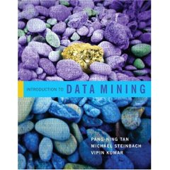

--- 
title: "R Companion for the Textbook Introduction to Data Mining"
author: "Michael Hahsler"
date: "`r Sys.Date()`"
site: bookdown::bookdown_site
github-repo: mhahsler/Introduction_to_Data_Mining_R_Examples
documentclass: book
bibliography: [book.bib, packages.bib]
#biblio-style: apalike
link-citations: yes
nocite: '@*'
description: "This book contains documented R examples to accompany several chapters of the popular data mining text book _Introduction to Data Mining_ by Pang-Ning Tan, Michael Steinbach and Vipin Kumar (1st or 2nd edition)."
---

```{r setup, include=FALSE}
options(
  htmltools.dir.version = FALSE, formatR.indent = 2,
  width = 55, digits = 4, warnPartialMatchAttr = FALSE, warnPartialMatchDollar = FALSE
)
local({
  r = getOption('repos')
  if (!length(r) || identical(unname(r['CRAN']), '@CRAN@'))
    r['CRAN'] = 'https://cran.rstudio.com' 
  options(repos = r)
})
```

```{r include=FALSE}
all_pkgs <- character()

format_pkgs <- function(pkgs)
  paste(sapply(pkgs, FUN = function(p) sprintf('_%s_ [@R-%s]', p ,p)), collapse = ', ')
```

# Preface {-}

This book contains documented R examples to accompany several chapters of the popular data mining textbook
[_Introduction to Data Mining_](https://www-users.cs.umn.edu/~kumar001/dmbook/)
by Pang-Ning Tan, Michael Steinbach, Anuj Karpatne and Vipin Kumar.

The code can be used with either edition: 1st edition [@Tan2005] or 2nd edition [@Tan2018].

 
 

The code examples collected in this book were developed for the course [CS 7331 - Data Mining](http://michael.hahsler.net/SMU/EMIS7331) 
taught at [SMU](http://www.smu.edu) since Spring 2013 and will be regularly updated and improved. 
The latest update includes the use of the popular packages in the meta-package `tidyverse` [@R-tidyverse] including `ggplot2` [@R-ggplot2] for data wrangling and visualization along with
`caret` [@R-caret] for model building.

 The online version of this book is licensed under the [Creative Commons Attribution-NonCommercial-ShareAlike 4.0 International License](http://creativecommons.org/licenses/by-nc-sa/4.0/).

Please use the edit function within this book or visit
the [book's GitHub project page](https://github.com/mhahsler/Introduction_to_Data_Mining_R_Examples) to submit corrections or suggest 
improvements. To cite this book use:

> Michael Hahsler (2021). _R Companion for the Textbook Introduction to Data Mining._ Online Book. https://mhahsler.github.io/Introduction_to_Data_Mining_R_Examples/book/

I hope this book helps you to learn to use R more efficiently for your data mining projects.

Michael Hahsler